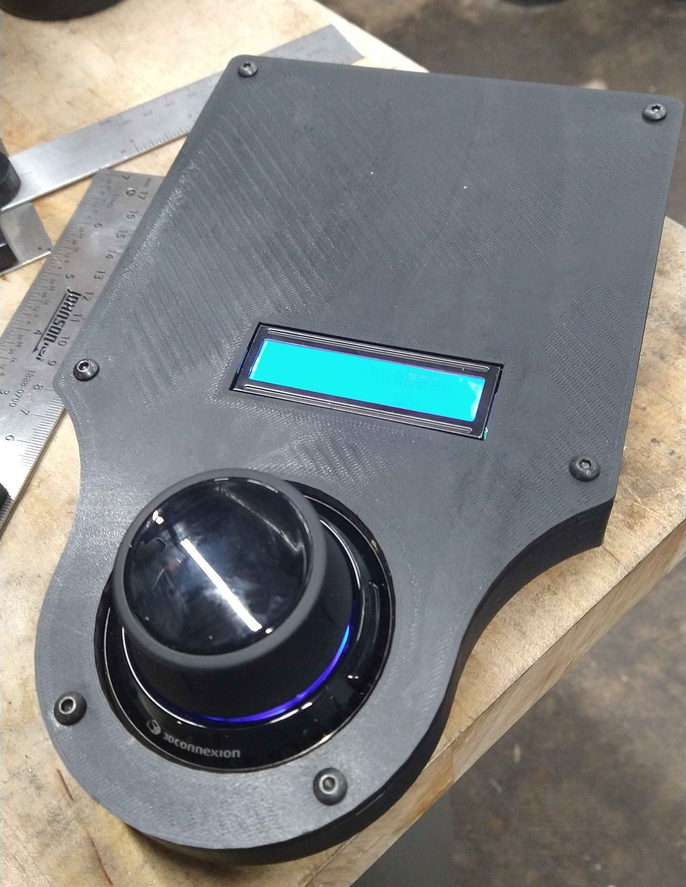

A subproject of the car project. This portable controller has a power on/off switch for ease of use and a USB-C charger slot so that it can be charged by any generic USB-C charger. It contains the REYAX RYLR896 RF module for transmitting to the Electric Vehicle, an HD44780 LCD screen with I2C backpack, raspberry pi 3, 5V 2.5A power bank, and a 3DConnexion SpaceMouse for input.

  
  

The LCD Screen displays the current left and right motor packet (intensity and direction) as well as a short string that demonstrates the intended action (slight left, hard right, drag turn, etc.)

The SpaceMouse is used to control the vehicle, rotating it left and right to indicate turning, and forward and backward for that. The side buttons are currently used to exit the program, but will eventually be used to flip the relays on the PCB and change gear for the vehicle.

Controller Schematic:

  

