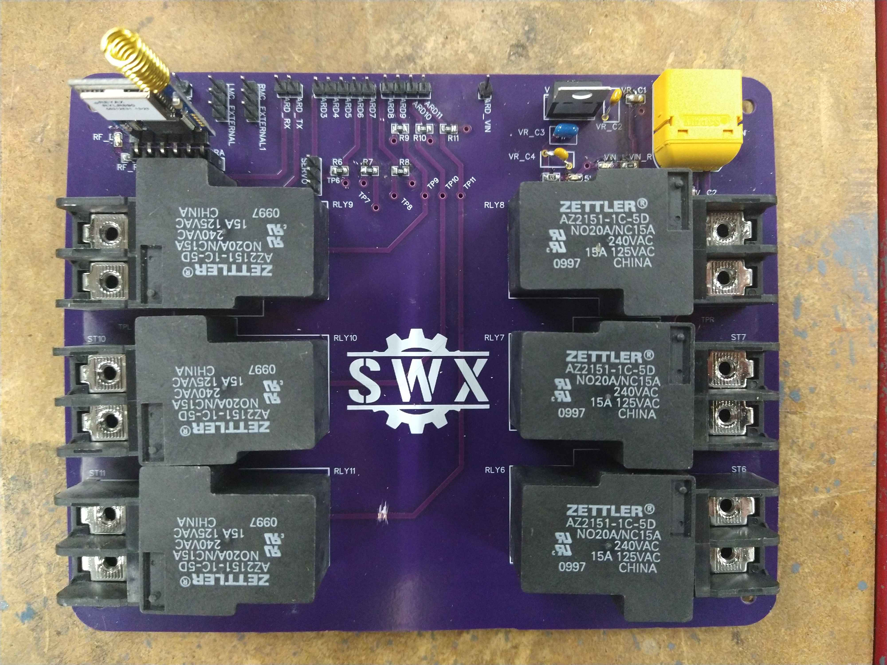
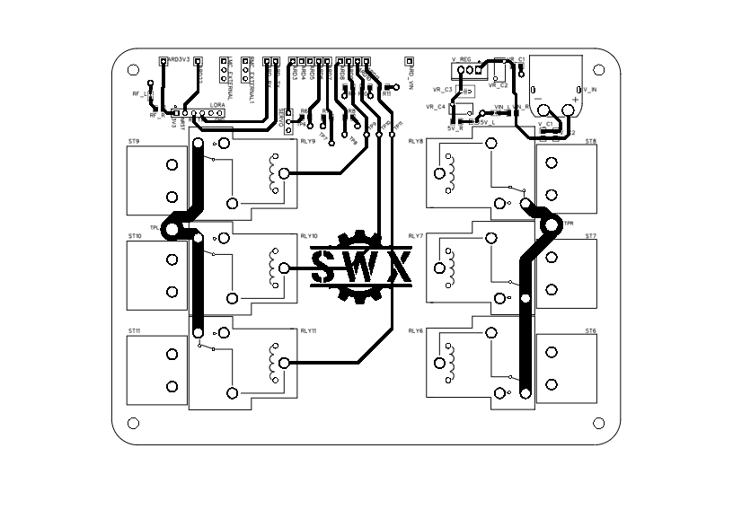
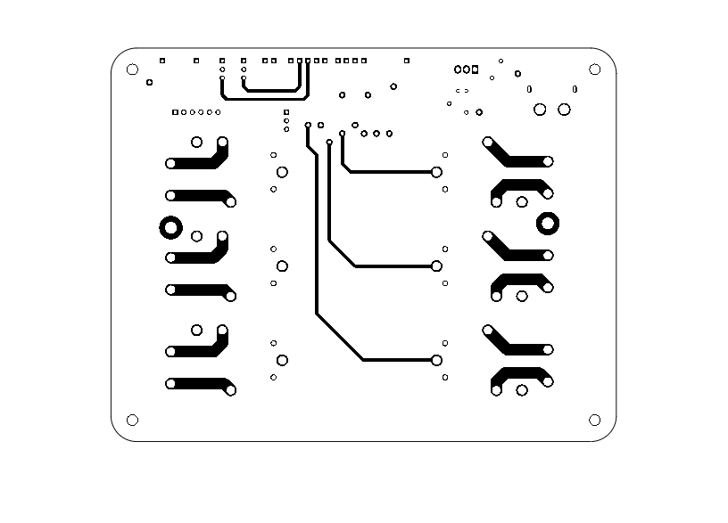

In this ongoing project, we use dahlander motor technology via mechanical relays to alter the torque / speed of the electric vehicle. A custom PCB is used to route all the wiring connections from the Arduino MEGA to the RF Receiver, relays, battery, and motor / motor controllers.

  

The PCB is a 4-layer design consisting of a Signal-Ground-Power-Signal stackup. The top and bottom (signal) layers can be seen below:

  

  

  

