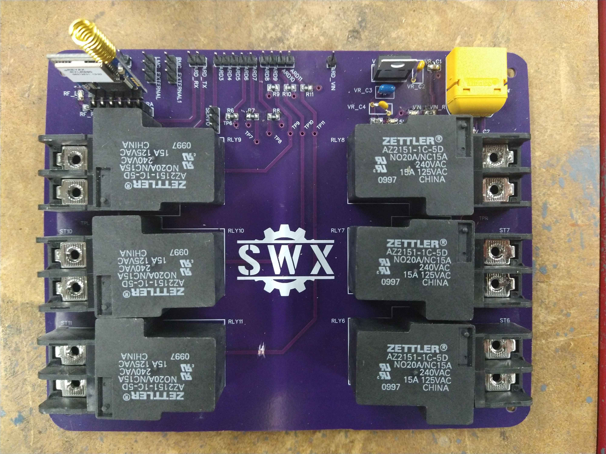
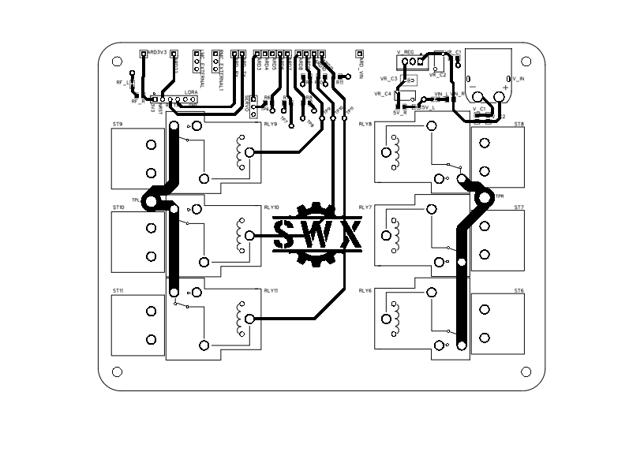
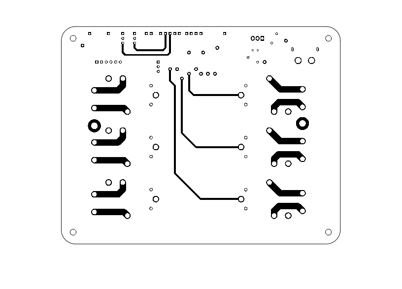

In this ongoing project, we use dahlander motor technology via mechanical relays to alter the torque / speed of the electric vehicle. A custom PCB is used to route all the wiring connections from the Arduino MEGA to the RF Receiver, relays, battery, and motor / motor controllers.

  

The PCB is a 4-layer design consisting of a Signal-Ground-Power-Signal stackup. The top and bottom (signal) layers can be seen below:

  
  

This schematic shows the different aspects of the design. VCC is used to denote the power source (likely a 3S to 5S Lithium Polymer battery). A 7805L is used to drop the battery voltage down to 5V for delivery to the majority of the other components. The 3.3v required to power the REYAX RYLR896 (RF module) is acquired from the 3v3 pin on the Arduino, because the current supplied by this pin is enough to power the module without any trouble.

  

Portable Controller subproject has its own readme in the Portable Controller folder.
